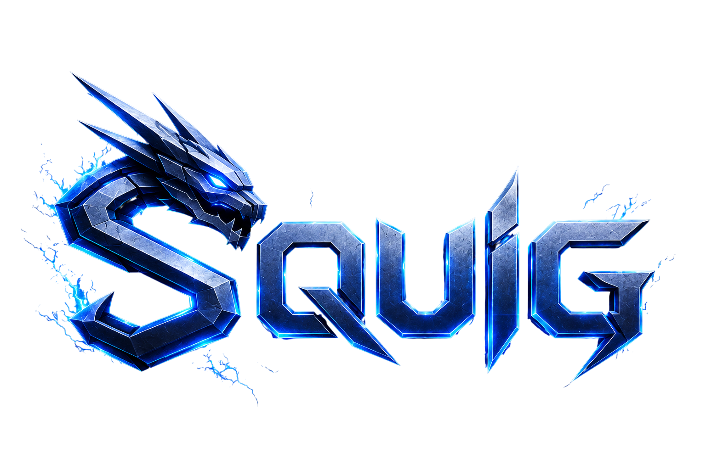

<p align="center">
  
</p>

<h1 align="center">⚡ Squig Programming Language ⚡</h1>

<p align="center">
  A custom programming language built with Python to explore how interpreters and programming languages work internally.
</p>

<p align="center">
  
  
  
</p>

---

# ✨ About

**Squig** is an educational programming language built from scratch using Python.  
The project focuses on understanding the internals of language design and interpreter implementation.

It explores concepts like:

- 🔹 Tokenization (Lexer)
- 🔹 Parsing
- 🔹 Abstract Syntax Trees (AST)
- 🔹 Interpreters & Execution Engines
- 🔹 Variables and Expressions
- 🔹 Functions & Scope Handling
- 🔹 Runtime Environments
- 🔹 Error Reporting

> This is not intended to be a production-ready language.  
> It is a learning-focused project for experimenting with compiler and interpreter design.

---

# 🚀 Features

- ✅ Custom language syntax
- ✅ Lexer implementation
- ✅ Parser implementation
- ✅ AST generation
- ✅ Expression evaluation
- ✅ Variables and assignments
- ✅ Error diagnostics
- ✅ CLI execution support
- ✅ Modular architecture

---

# 📁 Project Structure

```bash
squig/
│
├── Lexer.py          # Converts source code into tokens
├── Parser.py         # Builds AST from tokens
├── Interpreter.py    # Executes AST nodes
├── squig.py          # CLI tool to run Squig programs
├── scripts/          # Built-in libraries
├── tests/            # Unit tests
└── README.md
```

---

# 💻 Example

```py
>>> let x : 10  # assign value 10 to 'x'
>>> let y : 20  # assign value 20 to 'y'
>>> log x + y   # print result
```

### Output

```txt
30
```

---

# 🎯 Learning Goals

This project is focused on learning:

- 🧠 How interpreters work internally
- 🧠 Parsing techniques
- 🧠 Language design principles
- 🧠 AST traversal
- 🧠 Scope and symbol tables
- 🧠 Runtime execution models
- 🧠 Error diagnostics

---

# 👨‍💻 Contributors

<table align="center">
  <tr>
    <td align="center">
      <a href="https://github.com/Harish-M-2003">
        
        <br />
        <sub><b>Harish</b></sub>
      </a>
    </td>
    <td align="center">
      <a href="https://github.com/the-madhankumar">
        
        <br />
        <sub><b>Madhan Kumar</b></sub>
      </a>
    </td>
  </tr>
</table>

---

# 🛣️ Roadmap

Planned features:

- [ ] Better parser error messages
- [ ] Functions
- [ ] Loops and conditionals
- [ ] Standard library support
- [ ] Bytecode compiler
- [ ] Virtual Machine implementation
- [ ] Garbage collection experiments

---

# 📜 License

This project is open-source and available under the **MIT License**.

---

# ⚠️ Note

This repository is mainly for educational purposes and experimentation.

Expect:
- Frequent changes
- Experimental features
- Broken implementations
- Lots of learning 🚀